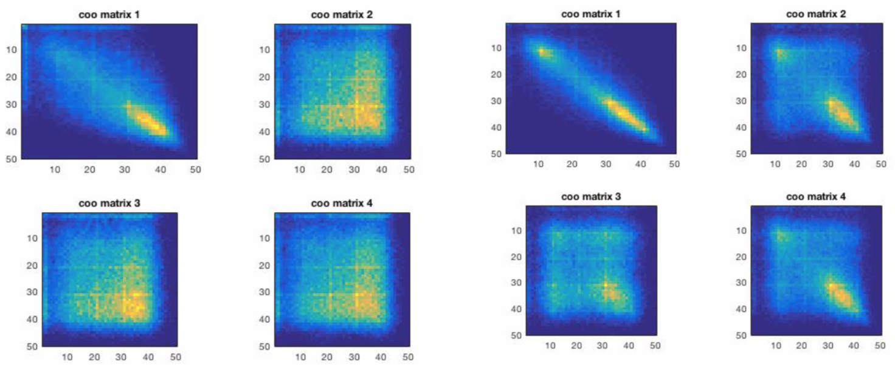
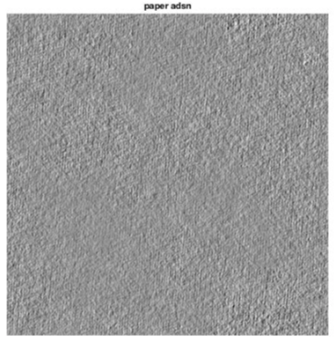
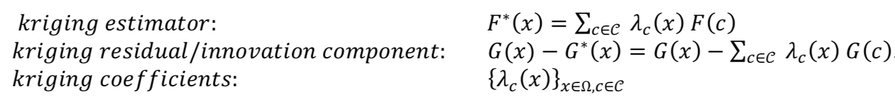

# Texture InPainting by Gaussian model

We implemented the inpainting method for texture images introduced in

> *Microtexture inpainting through gaussian conditional simulation*, Bruno Galerne, Arthur Leclaire, Lionel Moisan

**Inpainting** is the task of **recovering** a missing region of an image. This region is called a **masked region**. The paper we followed propose an inpainting method in the case of texture images. In this framework texture images are supposed to be a **random gaussian field**. Authors used the work of Julesz, on the **translation invariance** of texture images statistics of order 1 and 2, to model and **estimate the variance** of this gaussian vector. Masked region is then recovered by **conditional simulation**.

## Short presentation of the method

  

We model our pixels grid as a Markov random field. **Markov property** states that:

  

We will use the **Markov blanket** around the masked region in order to infer inpainted region (recovered region). Here is an example of a Markov blanket of one pixel in a Markov random field.

  

Following Julesz's theory it is assumed that statistics of order 1 and 2 are translation invariant in the case of texture images.

Here is an example where we compared statistics of order 1 and 2 for two images of pebbles. We can notice the similarity of pixel statistics for these two images.

  

  

Starting from a **Discret Spot Noise** (DSN) we can generate texture image by using the model:  

  

We have the theorical guarantee from Central Limit Theorem that asymptotically it will follow a gaussian distribution. Hence we have the following result:

  

 
 Therefore we notice that we obtain a **stationary** gaussian process.  
 
 In the following we used this model to sample a texture image of paper by consecutive translation of spot noise (small patch from texture image).

  
  

Finally we want to sample H = F* + G - G* where G ~ F and G independant of F. We will sample the **kriging estimator** F* and the **kriging residual or innovation component** G - G* using the **kriging coefficients**. In summary:

  

And to compute the kriging coefficients we need to solve the ordinary kriging system 

  

 
 whereL:
 
 

  

## Results
